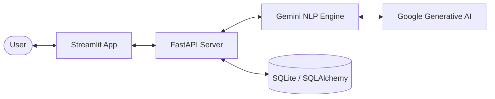

# 📦 Stock Assistant Bot

[](https://fastapi.tiangolo.com/)
[](https://streamlit.io/)
[](https://ai.google.dev/)
[](https://www.sqlite.org/)

**Stock Assistant Bot** is an AI-powered Warehouse Management Assistant designed to bridge the gap between human language and structured inventory data. Using Google Gemini's advanced LLM capabilities, it parses natural language queries—including hybrid "Hinglish" (Hindi + English)—to provide real-time stock availability and pricing information.

---

## 🚀 Key Features

- **🧠 Intelligent Parsing**: Leverages Google Gemini to extract intents and entities from unstructured text.
- **🇮🇳 Multi-Lingual Support**: Native support for Hinglish queries (e.g., *"Product 2001 ka rate kya hai?"* or *"Item ABC milega kya?"*).
- **📦 Multi-Item Extraction**: Handle multiple product queries in a single message (e.g., *"Check stock for 2001 and 2002"*).
- **⚡ Real-time Inventory**: Synchronized with a local SQLite database for instant price and stock lookups.
- **💬 Streamlit Frontend**: A sleek, reactive chat interface for seamless user interaction.
- **🛠️ Automated Database Seeding**: Automatically parses inventory CSVs and seeds the database on the first run.

---

## 🏗️ Architecture



---

## 🛠️ Tech Stack

- **Backend**: FastAPI (Python)
- **Frontend**: Streamlit
- **LLM**: Google Gemini API (`gemini-2.5-flash-lite`)
- **Database**: SQLite with SQLAlchemy ORM
- **Data Handling**: Pandas (for initial seeding)

---

## 🏁 Getting Started

### Prerequisites

- Python 3.9+
- A Google Gemini API Key ([Get it here](https://aistudio.google.com/app/apikey))

### 1. Installation

Clone the repository and install the dependencies:

```bash
cd vivre
pip install -r requirement.txt
```

### 2. Environment Configuration

Create a `.env` file in the root directory (you can use `.env.example` as a template):

```env
GEMINI_API_KEY=your_gemini_api_key_here
```

### 3. Running the Application

The bot requires both the backend and frontend to be running simultaneously.

**Step A: Start the FastAPI Backend**
```bash
uvicorn main:app --reload
```
The backend will automatically initialize the database and seed it from `test_item.csv` if it doesn't already exist.

**Step B: Start the Streamlit Frontend**
```bash
streamlit run streamlit_app.py
```

---

## 📖 Usage Examples

Once the app is running, you can interact with the chatbot using natural language:

- **Stock Inquiry**: *"Check stock for 2006"* or *"2006 available hai kya?"*
- **Price Inquiry**: *"What is the price of item 2001?"* or *"2001 ka rate kya hai?"*
- **Combined Inquiry**: *"Price and availability for 2001 and 2002"*
- **Quantity Check**: *"Do we have 50 units of 2006?"*

---

## 🚀 Testing with Postman

For testing the API endpoints directly (e.g., `/chat`), we have included a Postman collection:

- **Collection File**: `stockbot.postman_collection.json`

**Steps to Import:**
1.  Open **Postman**.
2.  Click the **Import** button in the top left corner.
3.  Drag and drop the `stockbot.postman_collection.json` file into the import window.
4.  Once imported, make sure your FastAPI backend is running at `http://localhost:8000`.
5.  Select any request and click **Send**.

---

## 📊 Data Source

The application uses `test_item.csv` as its primary data source for initial seeding. 

- **Columns**: Includes `Item ID`, `Item ID2` (Name), and `Stock On Hand`.
- **Seeding**: On first run, the FastAPI server reads this file and populates the `products` table in `stock_app.db` with sample prices.

---

## 🗂️ Project Structure

```text
├── main.py              # FastAPI application & endpoints
├── nlp_logic.py         # Gemini-driven NLP parsing logic
├── database.py          # SQLAlchemy models and DB initialization
├── streamlit_app.py     # Streamlit chat interface
├── test_item.csv        # Initial inventory data (used for seeding)
├── .env                 # Environment variables (API Keys)
├── stockbot.postman_collection.json # Postman collection for API testing
└── requirement.txt      # Project dependencies
```

---

## 🤝 Contributing

Contributions are welcome! If you'd like to improve the NLP logic, add new features, or fix bugs, please feel free to open a Pull Request.

---

## 📄 License

This project is licensed under the MIT License. See the [LICENSE](LICENSE) file for details (if applicable).
